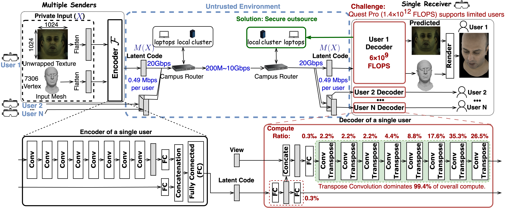

# Privatar: Privacy-Preserving Real-Time Multi-User VR Avatar Reconstruction

[](./LICENSE)

Privatar leverages both local (VR headset) and untrusted cloud hardware to achieve privacy-preserving multi-user avatar reconstruction. It horizontally partitions a frequency-decomposed VAE decoder, keeping privacy-sensitive low-frequency components local while offloading high-frequency components with calibrated noise injection.



---

## Repository Structure

```
/work/
├── multiface/                                    # Baseline VAE (DeepAppearanceVAE)
├── multiface_direct_split/                       # Direct architecture split into local + cloud
├── multiface_quantization/                       # Low-precision decoder (8-16 bit)
├── multiface_sparse/                             # Channel-pruned decoder (20-80% sparsity)
├── multiface_frequency_decompose/                # BDCT frequency decomposition (no offloading)
├── multiface_partition_frequency_decompose/       # BDCT + horizontal partitioning (Privatar)
├── experiment_scripts/
│   ├── dp_analysis/                              # Differential Privacy noise generation
│   ├── pac_analysis/                             # PAC Privacy noise generation
│   ├── empirical_attack/                         # Attack configs and frame lists
│   ├── bdct_reconstruction/                      # BDCT visualization notebook
│   ├── render_scripts/                           # Expression rendering utilities
│   ├── figure_drawer/                            # scripts to draw all figures
│   └── dataset_config/                           # Dataset download scripts
├── dataset/                                      # Multiface dataset (created during setup)
├── pretrain_model/                               # Pretrained model checkpoint
├── training_results/                             # All training outputs
└── testing_results/                              # All testing outputs
```

Each model variant directory contains:
- `train.py` / `test.py` -- core training and testing logic
- `launch_train_job_serial.py` / `launch_test_job_serial.py` -- launcher scripts with configurable parameters
- `latency_profiling_script*.py` -- inference latency measurement
- `models.py` -- model architecture definitions

---

## Prerequisites

**Hardware:**
- NVIDIA GPU with CUDA support (validated on RTX 5090; RTX 3090/4090 also supported)
- 16 GB+ GPU memory, 52 GB+ system RAM
- 1 TB disk space (dataset + models + results). The full dataset for one identity does require **terabytes of storage**. However, for **functional correctness testing**, only a **small subset** of the dataset is needed (`Privatar/experiment_scripts/dataset_config/minimal_config.json`), and that subset requires **no more than 50 GB** of disk space.

**Software:**
- NVIDIA Docker: `nvcr.io/nvidia/pytorch:24.01-py3`
- For RTX 5090: nightly PyTorch with CUDA 13.0 support

---

## Installation

### Step 1: Launch Docker Container

```bash
# Pull the Docker image
docker pull nvcr.io/nvidia/pytorch:24.01-py3

# Clone the repository
git clone https://github.com/georgia-tech-synergy-lab/Privatar.git

# Launch with GPU access (replace <path> with your local clone path)
docker run --gpus all -v <path>:/work \
  -it --ipc=host --ulimit memlock=-1 \
  --ulimit stack=67108864 --memory 51200m \
  --rm nvcr.io/nvidia/pytorch:24.01-py3
```

> **All commands below assume `/work` is the mount point inside Docker.**

### Step 2: Install Dependencies

```bash
# OS-level dependencies
apt-get update && apt-get install -y mesa-common-dev libegl1-mesa-dev libgles2-mesa-dev mesa-utils

# Python packages
pip3 install Pillow ninja imageio imageio_ffmpeg six tensorboard opencv-python wandb torchjpeg lpips

# For RTX 5090 only: install nightly PyTorch with CUDA 13.0
pip install -U --pre torch torchvision torchaudio --index-url https://download.pytorch.org/whl/nightly/cu130

# Install nvdiffrast
git clone https://github.com/NVlabs/nvdiffrast
cd nvdiffrast && python3 setup.py install && cd ..

# For RTX 5090 only: apply nvdiffrast patch
source /work/experiment_scripts/nvdiffrast_patch.sh
```

> **Note:** `wandb` is optional (disabled by default). Set `wandb_enable = True` in any training/testing script to enable real-time monitoring.

### Step 3: Download Dataset

```bash
mkdir -p /work/dataset
python3 /work/experiment_scripts/dataset_config/download_dataset.py \
  --dest "/work/dataset" \
  --download_config "/work/experiment_scripts/dataset_config/mini_download_config.json"
```

This downloads the Multiface dataset for subject 6795937 (~30 GB): facial images, tracked meshes, and unwrapped UV textures across 65+ expressions and 40 camera views.

### Step 4: Download Pretrained Model

```bash
mkdir -p /work/pretrain_model
wget -O /work/pretrain_model/6795937_best_model.pth \
  https://fb-baas-f32eacb9-8abb-11eb-b2b8-4857dd089e15.s3.amazonaws.com/MugsyDataRelease/PretrainedModel/6795937--GHS-base_nosl/best_model.pth
```

The pretrained base model (97 MB) initializes all training variants. Other subject models are listed at [Multiface pretrained models](https://github.com/facebookresearch/multiface/blob/main/documentation/INSTALLATION.md).

---

## Experiment Pipeline

The pipeline has 8 sequential steps. Each step depends on outputs from previous steps.

```
Step 1: Training ──> Step 2: Testing ──> Step 3: Latency Profiling
                          │
                          ├──> Step 4: Noise Calculation (DP + PAC)
                          │         │
                          │         └──> Step 5: Noisy Inference
                          │                   │
                          │                   ├──> Step 6: Empirical Attack
                          │                   └──> Step 7: NN-based Attack
                          │
                          └──> Step 8: Frequency Covariance Analysis
```

### Functional Test vs. Full Reproduction

| Parameter | Functional Test | Full Reproduction |
|-----------|----------------|-------------------|
| `val_num` | 30 | 500 |
| `max_iter` | 1000 | 100000 |
| Time per variant | ~16 minutes | ~48 hours |

To run a **functional test**, edit `val_num` and `max_iter` in each `launch_train_job_serial.py` before running. The baseline (`multiface/launch_train_job_serial.py`) ships with small defaults (`val_num=50`, `max_iter=100`); all other variants default to full reproduction values (`val_num=500`, `max_iter=100000`).

---

### Step 1: Training

Train all six model variants. Each produces a `best_model.pth` checkpoint in `/work/training_results/`.

| Variant | Directory | Command | Output Path |
|---------|-----------|---------|-------------|
| Baseline | `multiface/` | `python3 launch_train_job_serial.py` | `training_results/multiface/` |
| Direct Split | `multiface_direct_split/` | `python3 launch_train_job_serial.py` | `training_results/multiface_direct_split/` |
| Quantization | `multiface_quantization/` | `python3 launch_train_job_serial.py` | `training_results/quant_{8..16}/` |
| Sparsity | `multiface_sparse/` | `python3 launch_train_job_serial.py` | `training_results/sparse_0_{2..8}/` |
| Frequency Decompose | `multiface_frequency_decompose/` | `python3 launch_train_job_serial.py` | `training_results/partition_0/` |
| Partitioned (Privatar) | `multiface_partition_frequency_decompose/` | `python3 launch_train_job_serial.py` | `training_results/partition_{2..14}/` |

```bash
# Example: train a single variant
cd /work/multiface_partition_frequency_decompose
python3 launch_train_job_serial.py
```

**Configurable parameters** (edit in each `launch_train_job_serial.py`):
- Quantization: `bitwidth_list` (default: `[8, 9, 10, 11, 12, 13, 14, 15, 16]`)
- Sparsity: `sparsity_list` (default: `[0.2, 0.3, 0.4, 0.5, 0.6, 0.7, 0.8]`)
- Partitioning: `num_freq_comp_offloaded_list` (default: `[14]`; set to `[2, 4, 6, 8, 10, 12, 14]` for all configs)

**Expected output** (functional test, `max_iter=100000`): representative final training screen loss values:

| Variant | Screen Loss |
|---------|------------|
| Baseline | ~0.072 |
| Direct Split | ~0.073 |
| Quantization (8-bit) | ~0.073 |
| Sparsity (20%) | ~0.092 |
| Frequency Decompose | ~0.077 |
| Partitioned (14 offloaded) | ~0.077 |

---

### Step 2: Testing

Evaluate trained models on the test set. Computes MSE (screen, texture, vertex) and LPIPS metrics. Saves latent codes needed for noise calculation (Step 4).

```bash
# Run for each variant (same directory structure as training)
cd /work/<variant_directory>
python3 launch_test_job_serial.py
```

All results are saved to `/work/testing_results/`. Latent codes are stored in `testing_results/<project_name>/latent_code/`:
- `z_<id>.pth` -- local-path latent codes
- `z_offload_<id>.pth` -- offloaded-path latent codes

**Expected output** (using fully-trained models):

| Variant | Screen MSE | LPIPS |
|---------|-----------|-------|
| Baseline | ~0.076 | ~0.610 |
| Partitioned (14 offloaded) | ~0.077 | ~0.612 |

> **Rendering specific expressions:** To render a selected set of expressions (e.g., for figure generation), use `launch_test_selected_expressions.py` in each variant directory. Configure the expression list in `/work/experiment_scripts/render_scripts/test_image_path`. Run `python3 /work/experiment_scripts/render_scripts/render_test_expression.py` to generate ground-truth inputs.

---

### Step 3: Latency Profiling

Measure decoder inference latency. The baseline runs on **modeling VR headset** (when device is not VR headset, it defaults to CPU); all other variants run on **GPU** (modeling cloud execution). Uses `torch.jit.trace` for kernel optimization where applicable.

| Variant | Command | Device |
|---------|---------|--------|
| Baseline | `cd /work/multiface && python3 latency_profiling_script.py` | CPU |
| Quantization | `cd /work/multiface_quantization && python3 latency_profiling_script.py` | GPU |
| Sparsity | `cd /work/multiface_sparse && python3 latency_profiling_script.py` | GPU |
| Freq. Decompose | `cd /work/multiface_frequency_decompose && python3 latency_profiling_script.py` | GPU |
| Partitioned (local) | `cd /work/multiface_partition_frequency_decompose && python3 latency_profiling_script_local_path.py` | GPU |
| Partitioned (offload) | `cd /work/multiface_partition_frequency_decompose && python3 latency_profiling_script_offload_path.py` | GPU |

For FLOPs analysis across partition configurations:
```bash
cd /work/multiface_partition_frequency_decompose
python3 latency_flops_calculation.py
```

**Expected output** (RTX 5090):

| Configuration | Latency |
|---------------|---------|
| Baseline (CPU) | ~15.5 ms |
| Quantized (8-bit, GPU, traced) | ~0.69 ms |
| Sparse (10% pruned, GPU) | ~0.87 ms |
| Sparse (90% pruned, GPU) | ~0.42 ms |
| Freq. Decompose (GPU, traced) | ~0.59 ms |
| Partitioned local path (GPU) | 0.24--0.32 ms |
| Partitioned offload path (GPU) | 0.19--0.28 ms |
| FLOPs range | 1.48 G (14 offloaded) to 6.07 G (2 offloaded) |

> **Note:** `multiface_direct_split` is an analytical design choice; no latency profiling script is provided for it.

---

### Step 4: Noise Calculation

**Requires:** Completed training (Step 1) and testing (Step 2) to obtain latent codes.

Two noise mechanisms are supported:
- **Differential Privacy (DP):** Uniform noise based on L2 norm of latent codes ([Balle et al., 2017](https://arxiv.org/pdf/1702.07476))
- **PAC Privacy:** Non-uniform noise leveraging per-dimension covariance via SVD decomposition ([Xiao et al., CRYPTO 2023](https://arxiv.org/abs/2210.03458))

#### DP Noise Generation

```bash
cd /work/experiment_scripts/dp_analysis

# For baseline (complete offload)
python3 dp_noise_generation_for_multiface.py

# For partitioned configurations (local + offloaded branches)
python3 dp_noise_generation_for_partition_multiface.py
```

Output: `/work/experiment_scripts/dp_analysis/generated_dp_noise/`
- `dp_noise_completed_offloaded_multiface_decoder_{mi}.npy` (5 files)
- `dp_noise_partition_offloaded_decoder_{freq}_{mi}.npy` (40 files)
- `dp_noise_partition_local_decoder_{freq}_{mi}.npy` (35 files)
- **Total: 80 files**

#### PAC Noise Generation

```bash
cd /work/experiment_scripts/pac_analysis
python3 pac_noise_generation_for_partition_multiface.py
```

Output: `/work/experiment_scripts/pac_analysis/noise_covariance/`
- `pac_noise_partition_local_decoder_{freq}_{mi}.npy`
- `pac_noise_partition_offloaded_decoder_{freq}_{mi}.npy`
- **Total: 75 files**

Both use mutual information bounds `[4, 3, 1, 0.1, 0.01]` corresponding to posterior success rates `[98%, 82.7%, 40%, 9%, 3.5%]`.

---

### Step 5: Noisy Inference

**Requires:** Trained models (Step 1) and noise files (Step 4).

Inject generated noise into offloaded latent codes and evaluate avatar quality degradation.

```bash
cd /work/multiface_partition_frequency_decompose
python3 launch_noisy_test_job_serial.py
```

Toggle `using_pac_noise = True/False` to switch between PAC and DP noise. Results are saved to `/work/testing_results/test_noisy_partition_{freq}_{mi}/`.

**Expected output:**

| Configuration | Screen MSE |
|---------------|-----------|
| Partition-2 with PAC noise (MI=1) | ~0.086 |
| Partition-14 with DP noise (MI=0.01) | ~0.086 |

---

### Step 6: Empirical Attack

**Requires:** Trained models (Step 1) and noise files (Step 4).

The empirical attacker guesses expressions by matching predicted high-frequency texture components to precomputed reference components (see Fig. 14 in paper).

```bash
cd /work/multiface_partition_frequency_decompose
python3 launch_empirical_attack.py
```

Toggle `using_pac_noise = True/False` for PAC vs. DP noise. Results are saved to `/work/testing_results/empirical_attack_partition_{freq}_{mi}/`.

**Attack modes** (configured via booleans in `test_empirical_attack_run.py`):
- `accumulate_channel = True`: accumulates high-frequency components as reference
- `attack_from_high_frequency_channel = True`: uses only high-frequency components
- Both `False`: merges frequency components by ambiguity (configurable threshold)

**Expected output:** PSR ~3.1% for partition-14 with MI=1 PAC noise (prior rate: 1/56 = 1.8%).

---

### Step 7: NN-based Attack

**Requires:** Trained models (Step 1) and noise files (Step 4).

Train a 3-layer fully-connected classifier (256 -> 128 -> 66) to identify expressions from noisy offloaded latent codes.

```bash
cd /work/multiface_partition_frequency_decompose

# Train the attacker (10 epochs per partition config)
python3 launch_train_nn_attacker.py

# Test the attacker under various noise levels
python3 launch_test_nn_attacker.py
```

Training data: one sample per expression from `/work/experiment_scripts/empirical_attack/selected_expression_frame_list.txt`.

**Expected output:** PSR ~1.5% on noisy latent codes (below the 1/56 = 1.8% prior rate), confirming robustness against learned attacks.

---

### Step 8: Frequency Covariance Analysis

Analyze the covariance trace of each of the 16 BDCT frequency components to understand the variance distribution that motivates offloading high-frequency components.

```bash
cd /work/multiface_frequency_decompose
python3 launch_l2norm_freq_cov_analysis.py
```

**Expected output:**
```
trace of covariance = 11308.31 for freq component = 0
trace of covariance = 199.42   for freq component = 1
trace of covariance = 77.53    for freq component = 2
trace of covariance = 41.90    for freq component = 3
...
trace of covariance = 12.81    for freq component = 15
```

Low-frequency components (component 0) carry ~880x more variance than high-frequency components (component 15), confirming that high-frequency components are safe to offload.

---

## Additional Scripts

### BDCT Reconstruction Visualization

Interactive notebook for visualizing frequency decomposition of unwrapped textures:

```bash
jupyter notebook /work/experiment_scripts/bdct_reconstruction/bdct_4x4_reconstruction_dataloader.ipynb
```

### Expression Rendering

Render avatar predictions for a specified set of input images across all model configurations:

```bash
cd /work/<variant_directory>
python3 launch_test_all_expressions_RTX3090.py
```

Configure input images in `/work/experiment_scripts/render_scripts/test_image_path`. Results are saved to `/work/render_results/<configuration_name>/`.

---

## Customization

| Parameter | Location | Values |
|-----------|----------|--------|
| Training duration | `launch_train_job_serial.py` | `val_num`, `max_iter` |
| Partition configs | `num_freq_comp_offloaded_list` | 2, 4, 6, 8, 10, 12, 14 |
| Quantization bits | `bitwidth_list` | 8--16 |
| Sparsity ratio | `sparsity_list` | 0.2--0.8 |
| Noise type | `using_pac_noise` | `True` (PAC) / `False` (DP) |
| MI budget | `mi_list` / `mutual_info_bound_list` | 4, 3, 1, 0.1, 0.01 |
| Wandb logging | `wandb_enable` | `True` / `False` |
